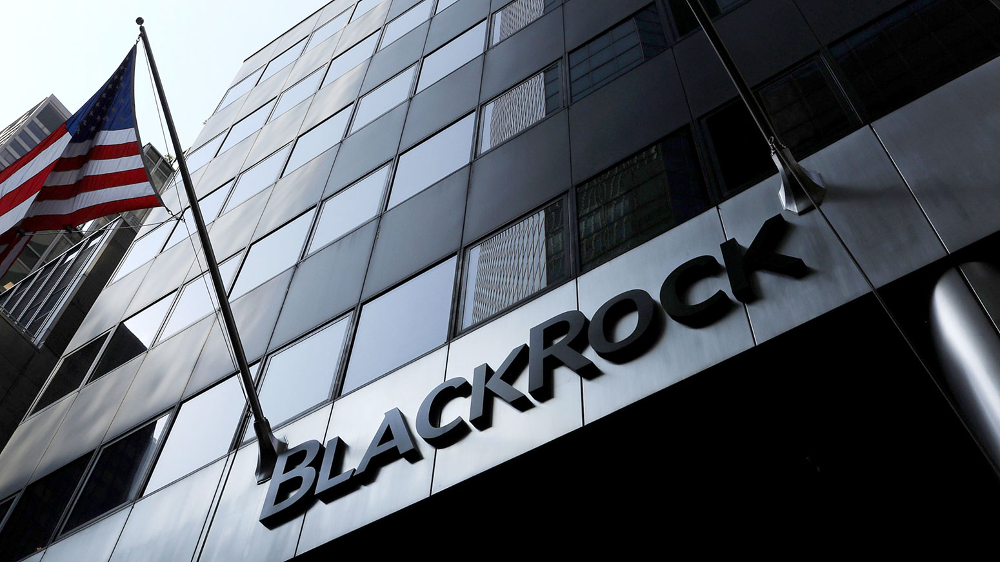

# Capital Investment

## Overview and Origin
Company's logo: 
1. What is the name of the company? 

**BlackRock**

2. When was the company incorporated? 

`BlackRock began in 1988 with eight people in a single room who shared a determination to put clients' needs and interests first.`

3. Who are the founders of the company? 

`There were 8 people: Larry Fink, Robert S. Kapito, Susan Wagner, Barbara Novick, Ben Golub, Hugh Frater, Ralph Schlosstein, and Keith Anderson`

4. How did the idea for the company (or project) come about? 

`Company's founders believed they could manage assets in a way that was better for their clients – by utilizing their passion for understanding and managing risk.`

5. How is the company funded?

`BlackRock is a publicly traded company that operates as a single business segment. The company's revenue comes mostly from investment advisory and administration fees. BlackRock is owned by a large number of individual and institutional investors, including BlackRock employees`

How much funding have they received? 

`As of June 2023, BlackRock had $9.4 trillion in assets under management (AUM). BlackRock's market cap or net worth is $105.82 billion as of September 14, 2023. This is up 6.09% in one year.`

---
## Business Activities

1. What specific financial problem is the company or project trying to solve? 

`Company manages money for institutional clients like corporate or public pension plans, and provide investment solutions that help both professional and personal investors build long-term wealth. BlackRock makes it possible for its clients and the people it serves to save for retirement, pay for college, buy homes, and start new businesses.`

2. Who is the company's intended customer?

`Clients are high-net-worth individuals, single- and multi- family offices, and foundations` 

Is there any information about the market size of this set of customers? 

`BlackRock's team of investment professionals has evaluated more than 7,000 investment opportunities and completed investments in 335 portfolio companies, which they have invested in excess of $5.8 billion in capital provided to middle-market companies through June 30, 2023.`

3. What solution does this company offer that their competitors do not or cannot offer? (What is the unfair advantage they utilize?)

`Aladdin is BlackRock's end-to-end investment management and operations platform used by institutional investors including asset managers, pension funds, insurers and corporate treasurers.`

4. Which technologies are they currently using, and how are they implementing them? 

`Aladdin: BlackRock's investment operating system that connects people, information, and technology to manage money in real time. Aladdin stands for Asset, Liability, and Debt & Derivative Investment Network. Aladdin uses AI and ML to process data and provide insights to help investment managers make decisions.`

`Aladdin Data Cloud: BlackRock's managed data-as-a-service solution powered by Snowflake's data platform`

`Cachematrix: A platform designed to optimize time and resources.`

---

## Landscape

1. What domain of the financial industry is the company in?

`Capital Investment`

2. What have been the major trends and innovations of this domain over the last 5–10 years?

`Sustainability: Sustainable bond issuance has grown fivefold over the past five years.`

`Impact investing: Private debt and fixed income impact investments have grown.`

`Technology: The use of technology and data has increased.`

`Emerging markets: The expansion of emerging markets has continued.`

`Exchange-traded funds (ETFs): The growth of ETFs has been the most disruptive trend in the asset management industry over the last 20 years`

3. What are the other major companies in this domain?

`Charles Schwab, Northern Trust, State Street, Vanguard, Fidelity Investments, Berkshire Hathaway.`

---
## Results

1. What has been the business impact of this company so far?

`BlackRock is an investment firm that controls a huge number of shares in some of the largest companies in the world. They have a total of $10 trillion in assets across the globe. That's an amount equal to half of America's total gross domestic product - controlled by just one company.`

2. What are some of the core metrics that companies in this domain use to measure success? How is your company performing, based on these metrics?

`Return on Investment (ROI)` *BlackRock's ROI = 4.35%*

`Internal Rate of Return (IRR)` *BlackRock'IRR = 23.5%*

`Net Asset Value (NAV)` *BlackRock's NAV = $105.53B*

`Earnings Before Interest, Taxes, Depreciation, and Amortization (EBITDA)`*BlackRock's EBITDA = $6.433B (for the June 2023)*

`Gross and Net Revenue Growth` *BlackRock's Gross and Net Revenue Growth = 751.91% (from 2006 to 2022)*

`Profit Margin` *BlackRock's profit margin = 29.9% (June 2023)*

3. How is your company performing relative to competitors in the same domain?

`Its main competitors included Vanguard, State Street Global Advisors, Fidelity, and PIMCO. BlackRock was known for its diverse investment strategies and leadership in sustainable investing.`

`BlackRock has taken a leadership role in sustainable and ESG (Environmental, Social, and Governance) investing. It offers a range of ESG-focused ETFs and actively engages with companies on ESG issues. BlackRock's commitment to sustainability has been a key differentiator in the industry.`

---
## Recommendations

1. If you were to advise the company, what products or services would you suggest they offer? 

`With the increasing interest in cryptocurrencies and blockchain technology, asset managers have been exploring digital asset management products. BlackRock may consider entering this space by offering investment products related to cryptocurrencies or blockchain-based assets.`

2. Why do you think that offering this product or service would benefit the company?

`I think that offering blockchain technology would definitely benifit the company, because cryptographic principles can provide high security measures to protect sensitive client and financial data. In my opinion it is important for maintaining trust in capital management industry.`

3. What technologies would this additional product or service utilize?

`It would utilize technology such as smart contracts.`

4. Why are these technologies appropriate for your solution?

`Creating investment products or funds focused on cryptocurrencies could attract a new client base and diversify the firm's offerings.`

---
## Web resources:
1. https://www.cambridge.org/core/journals/business-and-politics/article/hidden-power-of-the-big-three-passive-index-funds-reconcentration-of-corporate-ownership-and-new-financial-risk/30AD689509AAD62F5B677E916C28C4B6
2. https://www.blackrockbkcc.com/our-firm
3. https://www.zippia.com/blackrock-careers-904178/revenue/
4. https://www.macrotrends.net/stocks/charts/BLK/blackrock/ebitda#:~:text=BlackRock%20EBITDA%20for%20the%20twelve,a%203.52%25%20increase%20from%202019.
5. https://www.macrotrends.net/stocks/charts/BLK/blackrock/net-worth#:~:text=BlackRock%20net%20worth%20as%20of%20September%2014%2C%202023%20is%20$105.53B.&text=BlackRock%2C%20Inc.%2C%20together%2C,alternatives%20and%20money%20market%20instruments.
6. https://www.blackrock.com/us/individual/about-us/about-blackrock
7. https://www.blackrock.com/aladdin
8. https://businesschronicler.com/competitors/blackrock-competitors-analysis/
